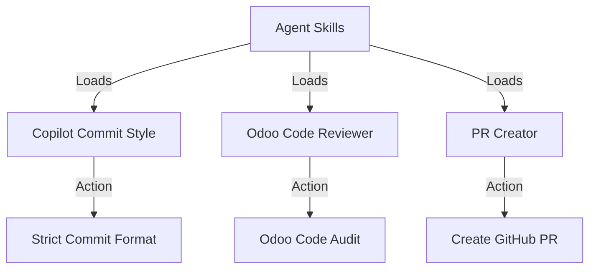
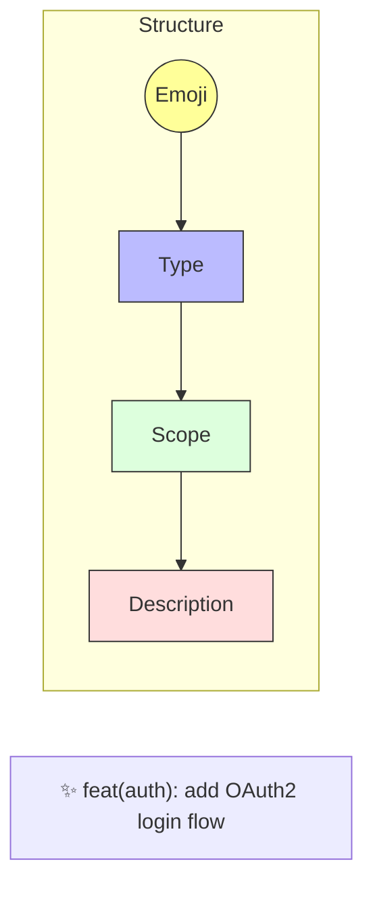
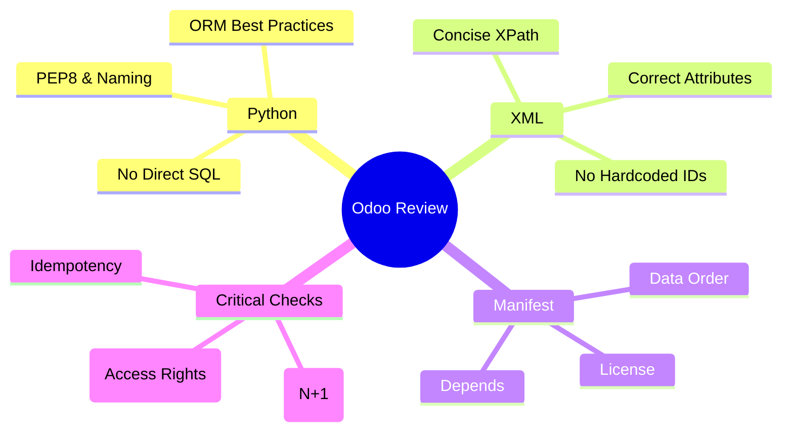

# Agent Skills

Collection of specialized skills to enhance AI agent capabilities.



## Available Skills

### 1. Copilot Commit Style
**Directory:** `copilot-commit-style/`

Enforces [Conventional Commits](https://www.conventionalcommits.org/).



**Key Rules:**
*   **Emoji** Required
*   **Lowercase** Type
*   **Max 80** characters

### 2. Odoo Code Reviewer
**Directory:** `odoo-reviewer/`

Expert reviewer for Odoo development projects.



### 3. PR Creator
**Directory:** `pr-creator/`

Creates GitHub pull requests with simple English title and body.

**Flow:**
1. Ask for destination branch if not specified
2. Check git status and push state — confirm with user if not clean
3. Push branch if needed
4. Generate short title + body from commits/diff
5. Run `gh pr create` and return URL

**Triggers:** "create PR", "open PR", "make pull request", "tạo PR"

## Usage

Agents load these skills from the `SKILL.md` file in each directory when specific tasks are requested.

## Installation

### Plugin Marketplace (recommended)

```
/plugin marketplace add nguyenhuy158/skills
/plugin install workflow@skills
```

Skills available after install:

| Slash command | Description |
|---|---|
| `/workflow:ship-ready` | Prepare branch and create PR |
| `/workflow:git-branch-clean` | Delete stale local branches |
| `/workflow:security-review` | OWASP Top 10 security audit |
| `/workflow:odoo-review` | Odoo Python & XML code review |
| `/workflow:commit-style` | Enforce Conventional Commits format |
| `/workflow:code-polish` | Remove comments, extract constants, self-documenting Python |

### Update

```
/plugin marketplace update nguyenhuy158/skills
```

Or reinstall:

```
/plugin install workflow@skills
```

### Manual (alternative)

```bash
git clone https://github.com/nguyenhuy158/skills ~/.claude/skills/nguyenhuy158-skills
```

Then reference each `SKILL.md` path in your Claude config.
