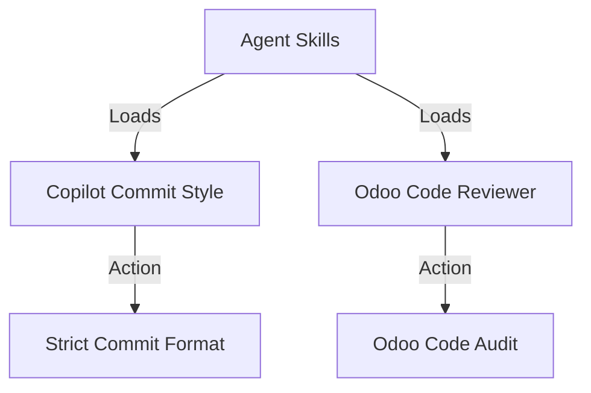
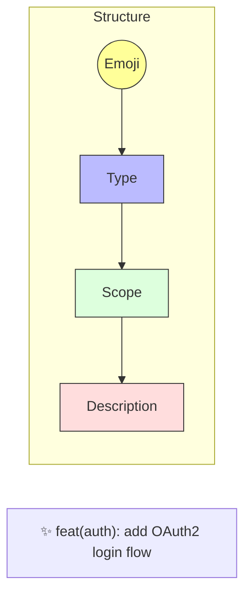
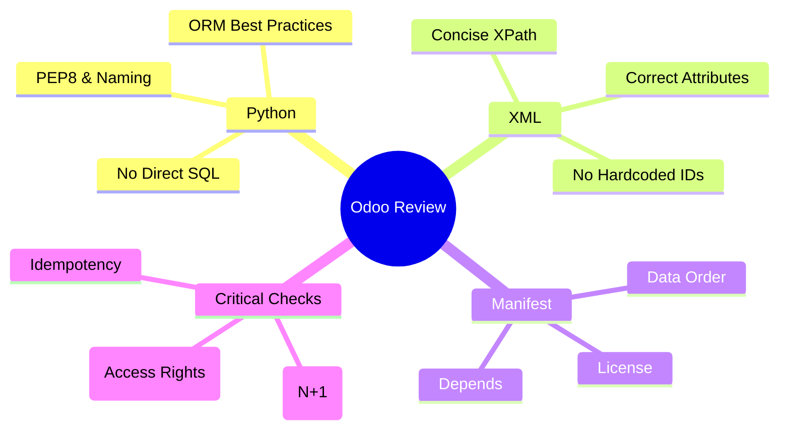

# Agent Skills

Collection of specialized skills to enhance AI agent capabilities.

## Available Skills

### 1. Copilot Commit Style
**Directory:** `copilot-commit-style/`

Enforces [Conventional Commits](https://www.conventionalcommits.org/).

**Key Rules:**
*   **Emoji** Required
*   **Lowercase** Type
*   **Max 80** characters

### 2. Odoo Code Reviewer
**Directory:** `odoo-reviewer/`

Expert reviewer for Odoo development projects.

## Usage

Agents load these skills from the `SKILL.md` file in each directory when specific tasks are requested.
